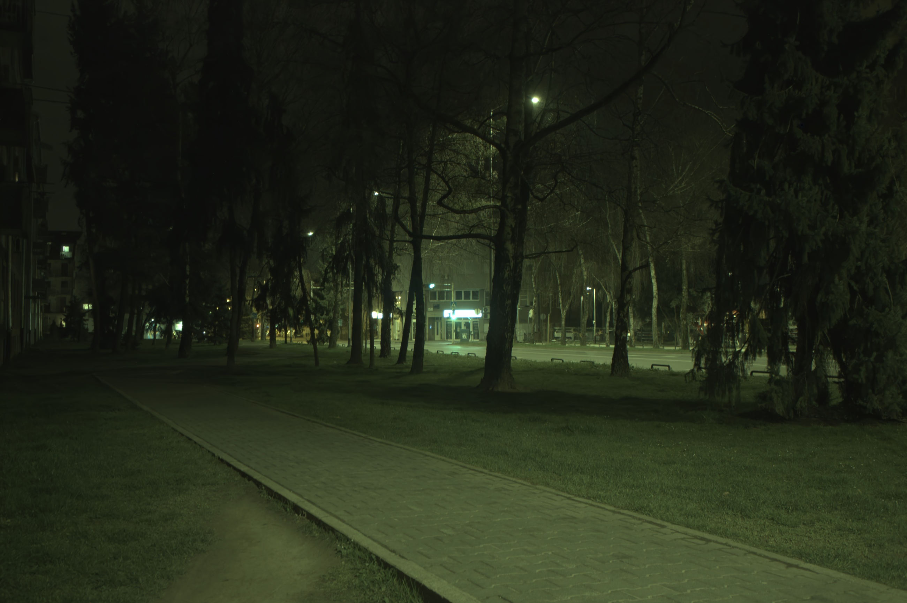

## Rendering Nighttime Image Via Cascaded Color and Brightness Compensation

<br/>
<table>
    <tr>
        <td width="33%"><center>RAW (visualized)</center></td>
        <td width="33%"><center>Conventional ISP</center></td>
        <td width="33%"><center>Our CBUnet</center></td>
    </tr>
</table>

<br/>

#### 1. Overview [[Paper]](https://arxiv.org/pdf/2204.08970.pdf) [[Project Webpage]](https://njuvision.github.io/CBUnet/) [[Dataset]](https://drive.google.com/file/d/10aiSgLPS18PYq_FnhPmFiNh0ikTNK0ul/view?usp=sharing)


This repository provides PyTorch implementation of the [Rendering Nighttime Image Via Cascaded Color and Brightness Compensation](https://arxiv.org/pdf/2204.08970.pdf). The model is trained for rendering nighttime RAW images into RGB. More visual results could be found in our [website](https://njuvision.github.io/CBUnet).

<br/>

#### 2. Prerequisites

- Python: requeriments.txt
- [PyTorch](https://pytorch.org/) libraries
- Nvidia GPU

<br/>

#### 3. Demo
- Download the pre-trained [denoising model dn_mwrcanet_raw_c1.pth](https://github.com/happycaoyue/NTIRE20_raw_image_denoising_winner_MWRCANet) <sup>*</sup>, [stage_1.checkpoint](https://drive.google.com/file/d/1kt1-ciljH9NKWExfMU7OijuhLRC6qUwv/view?usp=sharing) and [stage_2.checkpoint](https://drive.google.com/file/d/1kt1-ciljH9NKWExfMU7OijuhLRC6qUwv/view?usp=sharing) and put them all into `.pretrain` folder.
- Caupture the nighttime RAW image using your phone (iPhone app: [RAW+](https://apps.apple.com/us/app/raw/id1152205153), Android app: [Google Camera](https://play.google.com/store/apps/details?id=com.google.android.GoogleCamera&hl=zh&gl=US)) or DSLR cameras.

```bash
python demo.py -i xxx.dng
```

<br/>


#### 4. Training the model

Download the datasets from [[Dataset]](https://drive.google.com/file/d/10aiSgLPS18PYq_FnhPmFiNh0ikTNK0ul/view?usp=sharing) and edit the NR2R_ROOT in dataset.py

Download the pretrained stage-1 from [cube++.pth](https://drive.google.com/file/d/1K8CgwXp0Pk7yPNUWXOF6zbK9iHgpiVDS/view?usp=sharing) and stage-2 from [p4_2.pkl](https://drive.google.com/file/d/1iR8dk1NStkiwl3gl3cjoGHKdu0D5Ck3a/view?usp=sharing) <sup>**</sup> and put them all in `.pretrain` folder.

The model is trained stage by stage, start training from the stage-1:

```bash
CUDA_VISIBLE_DEIVCES=0 python train_stage_1.py -b 16 -d 0
```

then copy the stage_1's checkpoint to `.pretrain/stage_1.pth`

```bash
CUDA_VISIBLE_DEIVCES=0 python train_stage_2.py -b 16 -d 0
```

then copy the stage_2's checkpoint to `.pretrain/stage_2.pth`

```bash
CUDA_VISIBLE_DEIVCES=0 python finetune.py -b 16 -d 0
```

<br/>


#### 5. Test the provided pre-trained models

```bash
python test.py --stage1 xxx.checkpoint --stage2 xxx.checkpoint --visual visualization
```

<br/>

#### 6. Citation

```
@article{ignatov2020replacing,
  title={Replacing Mobile Camera ISP with a Single Deep Learning Model},
  author={Ignatov, Andrey and Van Gool, Luc and Timofte, Radu},
  journal={arXiv preprint arXiv:2002.05509},
  year={2020}
}
```

<br/>

#### 7. Contact

```
Zhihao Li (lizhihao6_at_outlook.com)
```

<br/>

#### 8. Thaks

```
Zhihao Li (lizhihao6_at_outlook.com)
```